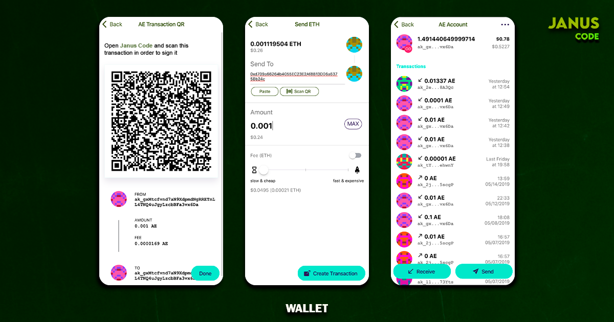

# Janus Code

<p align="left">
    
</p>

> Self custody made simple and secure. Protect your crypto and store your private keys offline.

[Janus Code](https://janusco.de) is a crypto wallet system that lets you secure cypto assets with one secret on an offline device. The [Janus Code](https://github.com/januscod/januscode) application is installed on a dedicated device that has no connection to any network, thus it is safe. The Janus Code Wallet is installed on your everyday smartphone.

## Description

Janus Code has an overview of all accounts with their respective balances and transaction histories. Janus Code never touches your secret data stored in the Janus Code. It is responsible for creating and broadcasting transactions. The prepared transaction is sent to the secure Vault over QR codes, where it is securely signed and sent back.

<p align="left">
    
</p>

## Download

- [Google Play](https://play.google.com/store/apps/details?id=it.janus.code) Coming 4th of March
- App Store Coming Soon...

## Features

- Portfolio overview of accounts synced from Janus Code
- Communication with the Vault application over QR codes if installed on a second device or app switching if installed on the same device
- Create transactions for all supported currencies like Aeternity, Bitcoin, Ethereum, Tezos, Cosmos, Kusama, Polkadot, Groestlcoin etc.
- Broadcast signed transactions
- Transaction history for each account

## Build

First follow the steps below to install the dependencies:

```bash
$ npm install -g @capacitor/cli
$ npm install
```

Run locally in browser:

```bash
$ npm run start
```

Build and open native project

```bash
$ npm run build
$ npx cap sync
```

You can now open the native iOS or Android projects in XCode or Android Studio respectively.

```bash
$ npx cap open ios
$ npx cap open android
```

## Testing

To run the unit tests:

```bash
$ npm test
```

## Disclosing Security Vulnerabilities

If you discover a security vulnerability within this application, please send an e-mail to help@janusco.de. All security vulnerabilities will be promptly addressed.

## Related Projects

- [Janus Code](https://github.com/januscod/januscode)
- [Janus Code Linux Distribution](https://github.com/januscod/Janus-Code-Distro)
